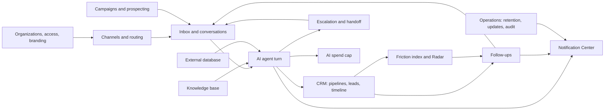

English summary generated from docs/architecture/*.architecture.json.

# DeskcommCRM architecture: feature summaries

**Overview**
- DeskcommCRM is a multi-tenant sales CRM. WhatsApp is the main channel and AI agents work alongside humans.
- Every feature map lists screens, API routes, workers/crons and tables, plus the edges (data or control flow) between them.
- The Postgres `event_log` and `job_queue` tables feed workers, so triggers never make HTTP calls.
- Every mutation writes `api_audit_log`, and problems surface as items in the Notification Center (`agent_inbox_items`).
- The Portuguese JSON files remain the source of truth; this file is a derived summary.

## Diagram: how the feature areas relate

## Table of contents
1. Knowledge base (`acervo-de-conhecimento`)
2. Google Calendar sync (`agenda-google-sync`)
3. Installation Meta app (`app-da-meta-da-instalacao`)
4. Self-service update (`atualizacao-self-service`)
5. External database (`banco-de-dados-externo`)
6. Campaigns (`campanhas`)
7. Notification Center (`central-avisos`)
8. Agency console (`console-de-agencia`)
9. Living CRM (`crm-vivo`)
10. Conversation and demand boundary (`encerramento-atendimento`)
11. Escalation and human cycle (`escalacao-ciclo-humano`)
12. Declarative extensions (`extensoes-declarativas`)
13. Follow-up dossier (`followup-dossie`)
14. Follow-up duplicate (`followup-duplicar`)
15. Follow-up on lead created (`followup-lead-criado`)
16. Follow-up templates (`followup-modelos`)
17. Follow-up on customer return (`followup-retorno`)
18. Catalog photos (`fotos-do-catalogo`)
19. Pipeline management (`gestao-funis`)
20. AI 360: organize the operation (`ia-360-organizar`)
21. AI 360: retention (`ia-360-retencao`)
22. Friction index and Demand (`indice-de-atrito`)
23. Interface per membership (`interface-por-vinculo`)
24. White-label branding (`marca-propria`)
25. Quick messages (`mensagens-rapidas`)
26. Organizations and access (`organizacoes-e-acesso`)
27. WhatsApp pre-go-live (`pre-go-live-whatsapp`)
28. Native prospecting (`prospeccao-nativa`)
29. History retention (`retencao-de-historico`)
30. Channel routing and recoverable connection (`roteamento-por-canal`)
31. AI budget cap (`teto-de-orcamento`)
32. Other files in the directory

## 1. Knowledge base
The organization owns a library of knowledge sources at `/app/ai/knowledge/sources`; each agent chooses which ones it reads. A person pastes text (`POST /ai/knowledge/sources`) or uploads a file (`.../sources/upload`); the file or a `.md` copy goes to the `ai-policy` bucket and a row goes to `ai_knowledge_sources`. Both routes emit `knowledge_source.updated` into `event_log`; the drain wakes `workers/rag-indexer.ts`, which resolves the embedding key once (`resolverChaveDeEmbedding`), extracts text (`extrairTextoDoArquivo`), writes `ai_chunks` and `ai_knowledge_versions`, and stamps `last_index_status`. At answer time `search_knowledge` uses `fn_buscar_trechos_das_fontes` and logs to `knowledge_searches`. A missing key shows in the UI (`ChaveDeConhecimento`) and in the Notification Center.

## 2. Google Calendar sync
Connected agendas and one destination calendar are edited in the settings screen; selection lives in `calendar_connection_calendars`. Push/sync crons pick appointments with pending intent, and `calendar-executor` and `sync-executor` do a three-way comparison against Google Calendar v3 (`transport` uses a stable POST and If-Match PATCH/DELETE). `calendar_appointments` holds the local revision; `fn_appointment_change_core` is the mutex for effects. Selected external events are cached in `calendar_selected_external_events` and feed free-slot computation. Conflicts are resolved by a human through `POST resolver/retry` with revision checks. Contact redaction clears snapshots, and Meet links are handled as request/receipt on the appointment.

## 3. Installation Meta app
The platform admin sets the Meta app secret and webhook verify token at `/admin/meta`. The server action upserts them encrypted into `platform_meta_app` (RLS with no policy); the secret is write-only and the token is shown once. `appDaMeta()` resolves database first, `.env` (`META_APP_SECRET`, `META_WEBHOOK_VERIFY_TOKEN`) as fallback, and the webhook `/api/v1/webhooks/meta/[token]` uses it for handshake and signatures. Connections (Official API) shows the token's origin. Changes are audited (`platform_meta_app.updated`) without values.

## 4. Self-service update
The button that replaces SSH. The host script `agent.sh` pulls: it heartbeats `POST /api/v1/system/agent`, which writes `system_version`. `GET /api/v1/system/version` feeds the sidebar footer notice; the page `/app/settings/atualizacao` posts `POST /api/v1/system/update`, inserting a `system_update_runs` row (`dispatched`). On the next heartbeat `agent.sh` runs `update.sh --to <tag>` and reports progress and result back; the page polls every 5 seconds. The app never pushes commands to the host.

## 5. External database
Organizations register read-only connections to an outside Postgres (`external_db_connections`, migration 0372, encrypted; `external_db_connections_safe` view for reads). `credenciais.ts`, `guardas.ts` (destination validation), `conexao.ts` (pool), `introspeccao.ts`, `leitura.ts` and `acesso.ts` sit behind routes for connections, test, schemas and paginated tables, with list and Explorer screens. AI agents and `/api/mcp` reach data through the `crm_describe` and `crm_query_external_data` tools. Mutations and tests are audited.

## 6. Campaigns
`/app/campaigns` (list, new, detail) creates a draft (`POST /api/v1/campaigns`), previews the audience, and runs actions (prepare, test, start, pause) validated by `maquina-de-estados.ts`. Preparation freezes the audience into `campaign_recipients` with fixed text. The `campaign-worker` cron (`rodada.ts`) sends one message per round: it checks `ritmo.ts` (campaign pace), `elegibilidade.ts` (blocked, anonymized) and `decidePacing` plus `pacing_ledger` (the number's pace, set by `channel_knobs`), then sends through `sendMessageHandler` and the `ChannelAdapter`. The funnel appears via `/[id]/metrics` and `/recipients`.

## 7. Notification Center
Runtime, channel, follow-up and cron producers write `agent_inbox_items`. `GET /api/v1/ai/inbox` lists them with RLS per record, `inbox-destino` projects a validated destination (conversation, contact, deal or setting), and the UI (`AgentInboxList`) links there without resolving anything. Resolving or reopening is a separate `PATCH` with audit: opening does not resolve.

## 8. Agency console
A client portfolio (`admin/usage`, `admin/tenants`) with Health and Agent tabs per tenant. `GET /api/v1/admin/tenants/[id]/agents` is read-only and filters `ai_agents` by organization, joining the published `ai_agent_versions` row, so an agency can see which agent is live for each client.

## 9. Living CRM
The nervous system between AI and pipeline. The `inbound-turn` ritual writes `lead_state`, `lead_checkpoints` and `before_send_traces`; `emitLeadActivity` turns new objections and non-sends into `crm_lead_activities` (unresolved ones become `activity_unrouted` in `event_log`). A trigger updates `crm_leads.last_activity_at`; `GET /leads/:id/timeline` feeds the Lead dossier via realtime. `lead_state.next_action` becomes a proposal slot on the Kanban card (Approve, Edit, Ignore). Also: `crm_lead_scores` (score worker), stage mirroring (`mirrorLeadStageToCrm`), a trigger promoting customers from scheduling, and `/app/audit`.

## 10. Conversation and demand boundary
Conversation and demand close independently, each with a revision (`close/reopen` compare-and-swap). An inbound message is persisted before the mutex and classified after. Jobs, enrollments, cases and crons keep an immutable origin; a pure comparator (`guard`) and the mutating tools and canonical send re-check it, and memory (current context, durable notes, history) follows the boundary. Accepted transport cannot be undone, and a receipt is kept per consumer.

## 11. Escalation and human cycle
The agent stops, a person continues, the agent resumes informed. `/app/ai/cases` (`CaseReplyPanel`) reads `agent_cases` and events; `POST /ai/cases/:id/reply` goes through `human-cases.ts`. "Resume automation" (`POST /conversations/:id/reactivate-bot` or MCP `crm_resume_ai_attendance`) runs one rule in `lib/escalacao/retomada.ts`, which reads the trail first (`continuidade.ts`: `human_replied` events, `conversation_notes`). State lives in `contacts.force_human`, `conversations`, `lead_checkpoints`; `isLeadInHandoff` blocks sends, and `ai.handoff_resolved` goes to `event_log`.

## 12. Declarative extensions
The instance owner admits a reviewed catalog (`extension_catalogs`); guards check role, MFA, support and trusted org. `extension_operations` records prepare/complete/cancel; downloads are size-limited with connection-bound DNS; `artifact` stores the immutable document and hash; `organization_extensions` binds state, config and revision per organization. `/app/extensions` and the Hub CRM expose it; capabilities such as `tasks.open` revalidate actor, org and role. Undo needs no download, and removal disables bindings. Audited in `api_audit_log`.

## 13. Follow-up dossier
`/app/ai/followups/enrollments/[id]` (opened from the queue tab) shows what already happened: `GET` reads `followup_enrollments` and `followup_enrollment_events`, projects readable events (`eventos-legiveis.ts`) and the time plan (`plano-de-tempo.ts`). Managers pause/resume/snooze/skip via routes calling `lib/followup/intervencao.ts`, which updates with the read status as a guard against the engine's claim (`fn_claim_due_followup_enrollments`, `engine.runFollowupTick`). Interventions write `crm_lead_activities` and audit; appointment presence integrates with the agenda.

## 14. Follow-up duplicate
One click on `FlowsList` calls `POST /ai/followup-flows/[id]/duplicate`: `nomeDaCopia()` picks the first free name, `rascunhoDoFluxo()` copies the graph, and a draft is inserted in `followup_flow_pointers`. Rename is `PATCH` (409 on name clash). Both audited.

## 15. Follow-up on lead created
The same `lead.created` event is emitted by lead creation and by the first conversation (`nascimento-do-lead`, `createLeadHandler`). The event_log drain triggers `gatilho-lead`, which enrolls leads when a pointer of kind `lead_created` is active; provenance shows in the dossier timeline.

## 16. Follow-up templates
From `FlowsList`, "Start from a template" opens `ModelosDialog` (static catalog `lib/followup/modelos/`, `montarEscada()`). `POST /ai/followup-flows/from-model` validates the stage, builds the graph, checks it with `flowGraphSchema` and `validateFlowForPublish`, inserts a draft pointer, audits, and redirects to the builder. Publishing later arms triggers (silence sweep, stage trigger, presence) run by the `followup-flow-worker` cron; a `followup-sem-agente` watcher raises Notification Center notices.

## 17. Follow-up on customer return
On `message.received` after a silence, `gapQualificaRetorno` decides whether the gap qualifies against the pointer's `threshold_minutes` (from the "Customer returned" trigger screen). `gatilho-retorno` enrolls and advances the first step at once, sending fixed text; `ceder-turno-ao-retorno` makes the agent turn yield so there is one voice only. The dossier shows who triggered it.

## 18. Catalog photos
Products get photos (migration 0390): the Products screen uploads/reorders through `POST/PUT /api/v1/products/:id/fotos` into the private `catalog-photos` bucket and `catalog_products.fotos`, audited. `crm_search_products` returns the photo count; `send_message` with `produto_codigo` copies the photo to `whatsapp-media/<org>/<conversation>` before the send chain (on failure, text only) and the Inbox shows the image.

## 19. Pipeline management
`/app/kanban` lists pipelines (`FunisClient`, `usePipelines`); `POST/PATCH/DELETE /api/v1/pipelines` use `_funis.ts` and `pipeline-editing.ts` for name and slug rules, default handling, and dependency checks the database does not enforce: leads (`crm_leads`), form sources (`webhook_sources`) and `automation_rules` pointing at the pipeline. Archive is the default; hard delete needs `?definitivo=1`. Audited; `trg_seed_default_pipeline_for_org` seeds new orgs.

## 20. AI 360: organize the operation
The agent can adjust configuration itself: `lib/mcp/tools/operacao.ts` and the REST routes call the same `lib/operacao/*` and `stage-operations.ts` functions, with the org always from context. `catalogo/operacao.ts` feeds the capabilities panel; `autoria.ts` stamps who (person or AI) made each change (`last_change_*`), shown by `SeloDeAutoria`. Covers `crm_stages`, `webhook_sources`, `automation_rules` (with `automation_rule_runs`) and inbound capture `POST /api/v1/webhooks/in/[token]`, with `webhook_lead_captures` and the "Leads received" tab. Outbound URLs pass `assertSafeOutboundUrl`.

## 21. AI 360: retention
The `reter` package of the catalog gives the agent tools: `crm_schedule_followup`, `crm_cancel_followup`, `crm_list_followups`, `crm_list_at_risk_leads`, `crm_close_demand`, `crm_propose_reactivation`. They are thin facades over `retorno-crm.ts`, sharing one rule (`lib/followup/retorno.ts`, window in `janela.ts`) with the engine's `schedule_followup` (`retorno-pg.ts`). Scheduled returns are `cron_jobs`; humans cancel from the queue tab via `POST /ai/followups/promises/:id/cancel`. Risk comes from `radar-de-risco.ts` at `/app/radar`; outcomes write `crm_lead_activities`, `crm_lead_reactivations` and audit.

## 22. Friction index and Demand
A Demand is the unit of purpose. `trg_demanda_abre_no_inbound` opens one on the first inbound message; `trg_demanda_fecha_com_conversa` resolves it when no other conversation is open; links are in `demanda_conversas`, with a pointer to `agent_cases`. `fn_atrito_metrics` (with `fn_atrito_jaccard` for repeated questions, threshold from `organizations.settings`) feeds `GET/PATCH /v1/metrics/atrito` and `AtritoPanel`. Leaks appear in the Radar (`GET /v1/leads/at-risk`), the Inbox side panel (`crm-summary`) and agent tools. `PATCH /v1/demandas/:id` closes demands.

## 23. Interface per membership
Presentation per member with no new authorization: the Team screen and invites (`issueInvite`) write `user_organizations.interface_settings` (Zod, admin role, trusted org). `loadAuthUser`, `resolveActiveOrg` and `AuthProvider` load it; the pure catalog projects RBAC intersected with interface for sidebar, mobile, hubs, search, home and bell. Realtime plus a self-context `GET` refresh it; changes are audited as `team.interface_changed`.

## 24. White-label branding
One Docker image serves all brands: database above `.env`. `install.sh` and `lib/env.ts` seed `platform_branding`; `/admin/marca` (`updateBranding`) and `/app/settings/marca` (`updateMarcaDaOrganizacao`, atomic RPC into `organizations.settings.branding`) edit it; logos use `POST/DELETE /api/v1/marca/logo` and the public `brand-logos` bucket. The resolver never throws. Tab, UI, e-mails and MFA issuer use the resolved brand; the LGPD PDF never does (it names the controller from `organizations.legal_name` and DPO). Changes audited.

## 25. Quick messages
A floating Inbox dock (`FloatingInbox`, opened from `AppShell`) reuses `ChatThread` and `Composer` and the existing conversation/message APIs with RLS and realtime hooks; it can expand to the full Inbox.

## 26. Organizations and access
`TenantSwitcher` opens organization management: `POST admin/tenants` calls `fn_create_tenant_with_owner`; `issueInvite` writes `team_invites` and `fn_accept_team_invite` accepts atomically; `setActiveOrg` and `resolveActiveOrg` give one context with cache reset. Support access ("Follow organization") uses `platform_support_sessions`, a read-only effect fence, and an explicit exit banner. Everything lands in the audit screens.

## 27. WhatsApp pre-go-live
A per-channel allowlist by phone number (Connections, `ChannelAiAccess`; `GET/PATCH channel-sessions/:id/ai-access` via `fn_configurar_pre_go_live_canal`). `gate.ts` applies to drain, turns, sweeps and automation, and to `sendMessageHandler`, watchdog redrive and re-reads, so only eligible numbers get AI replies. Audited as `channel.ai_access_updated` without phone numbers.

## 28. Native prospecting
From search to qualified customer: the operator sets audience, offer and pace; discovery finds and enriches candidates (capped), candidates are normalized per organization, and authorized activation creates contacts and deals. The scheduler and guards send the first approach, replies enter the Inbox, and qualification moves the real pipeline stage; failures pause the campaign. Agent setup keeps a persistent per-campaign session with revisions, a paused-draft sandbox preview and an ElevenLabs voice provider.

## 29. History retention
The `scheduler` (crond, 04:40 daily) calls `GET/POST /api/v1/cron/data-retention`. `podarHistorico()` (batches of 1000) uses `lib/retencao/politica.ts` (`JOB_QUEUE_RETENTION_DAYS`, `AUDIT_LOG_RETENTION_DAYS`) and calls `fn_podar_fila_de_jobs` (skips jobs with an open `job_dead` notice) and `fn_expurgar_auditoria_vencida`. Deleting `job_queue` cascades to `send_ledger` and `before_send_traces`. It audits `retention.sweep_run` only when something was deleted.

## 30. Channel routing and recoverable connection
Owners per number are set in Attendance (policy plus active members). The loader considers global load and local round-robin; an atomic claim (advisories, channel, conversation) assigns, otherwise a durable queue and actionable notice. Connect/repair uses an `Idempotency-Key`, an org-owned reservation and receipt, WAHA post-condition checks, and preserves FAILED for retry. Pairing offers QR or code (`pairing-code`: admin + MFA, audited without phone). Social network connections inbound reuse the existing Inbox.

## 31. AI budget cap
`BudgetCard` at `/app/ai/usage` uses `useAiBudget` against `GET/PATCH /api/v1/ai/budget`. `PATCH` is the only door writing `ai_budgets` (audited); loosening closes open `budget_exceeded` items. `getBudgetStatus` combines `fn_gasto_de_ia_do_mes`, `ai_budgets` and `llm_calls`; `decidirOrcamento()`, `AI_BUDGET_ENFORCEMENT` and `aplicarOrcamento` (run-model-call) enforce it in `runAgentTurn`, the legacy worker and the queue, opening notices and handoff. The stop is undone with "Resume automation".

## 32. Other files in the directory
- `agent-turn.workflow.json` and `agent-turn.html`: the AI agent turn workflow.
- `ponte-agendamento-followup.md`: the bridge between scheduling, follow-up and Radar (migration 0224): attendance recorded by humans through `fn_appointment_change`, `calendar_appointments` revisions, and settings in `organizations.settings.agenda`.
- `README.md`: the JSON is the source; HTML is derived.
